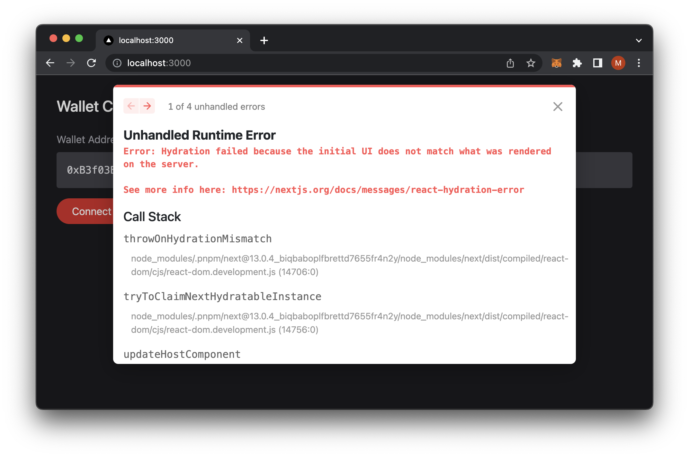

# NextJS WAGMI Hydration Issues

This code sample is demonstrates what is talked about in this article on [Understanding Hydration Errors In NextJS 13 With A Web3 Wallet Connection](https://codingwithmanny.medium.com)



## Requirements

- NVM or Node v18.12.1
- pnpm v7.15.0

## Getting Started

First, install dependencies and run the development server:

```bash
pnpm install;
pnpm run dev;

# Expected Output:
# > next13-wagmi-hydration@0.1.0 dev /path/to/next13-wagmi-hydration
# > next dev
# 
# ready - started server on 0.0.0.0:3000, url: http://localhost:3000
# event - compiled client and server successfully in 946 ms (154 modules)
```
